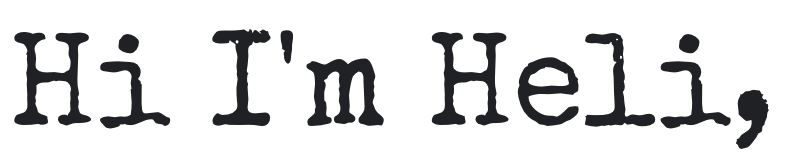

 <a  href="https://www.linkedin.com/in/heli-sivunen/"> 

**nice to meet you!** 👋.  

  
I'm a writer, freelance TV reporter and Full Stack / Front End Developer, working in React (mainly Gatsby), Swift and Ruby/Rails.  

Projects below! 👇🏻   

  

## Projects

|    Project details                                        |    Demo                                        |  
| :-------------------------------------------------: | :-------------------------------------------------: |
|     <a href="https://github.com/PacificRebel/NYTimes_headlines_iOS">**iOS New York Times Top Stories App**</a>       |             
|               `Swift` app which calls the New York Times API.    Tech stack: `Swift`, `Xcode`.    |   
|     <a href="https://github.com/PacificRebel/openweather">**Weather App**</a>
|               `Next.js` app which calls the OpenWeatherMap API, styled with `Chakra`. Deployed: https://practical-liskov-2292fb.netlify.app/  Under construction! 🛠      Tech stack: `React (Next.js)`, `Chakra`, `CSS`, `HTML` |  
|    <a href="https://github.com/PacificRebel/Team-6-Game">**Jack The Ripper**</a>
`iOS` native Jack the Ripper geolocation game. This was my final project at Makers,  designed and written in a group of 6.  Here's my blog! https://medium.com/@helisivunen   Tech stack: `Swift`, `Xcode`.                   |     
|         <a href="https://github.com/PacificRebel/portfolio-site">**Portfolio**</a>
|              My portfolio, linked to my repos via the GitHub API.    Tech stack: `Gatsby`,`React`, `Flexbox`, `Google Fonts`.   Deployed: https://friendly-kepler-67683c.netlify.app/  Under construction! 🛠                                         |  |
|         <a href="https://github.com/PacificRebel/headline-search">**Headline Search**</a>
|              `API` call app for searching FT headlines.   Tech stack: `Ruby`, `Rails`, `CSS` to emulate FT's colour and font.                                          |  |
|         <a href="https://github.com/PacificRebel/tarvikkeet">**Tarvikkeet**</a>                              |                                                   |
|              Finnish-language front end CRUD project to learn CSS and `scrollytelling` with still images and video.    Tech stack: `Ruby`, `Rails`, `HTML`, `CSS`.                                          | 

